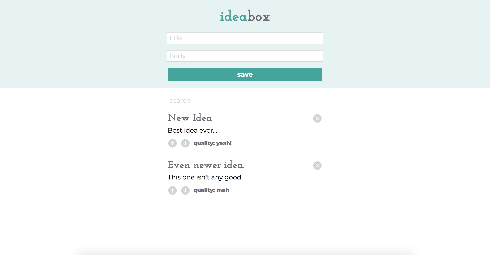

This is a remake of an earlier vanilla JS project built for Turing School of Software & Design.  This version was built over a school break using React, with the intention of improving skills with React.

It's a simple app that allows a user to create and save ideas.  Ideas can be filtered using search and rated by quality.  They persist using local storage.

********

